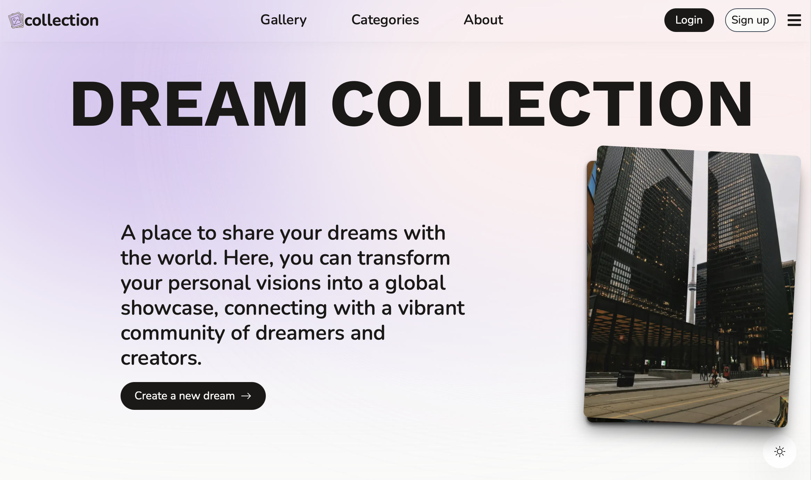
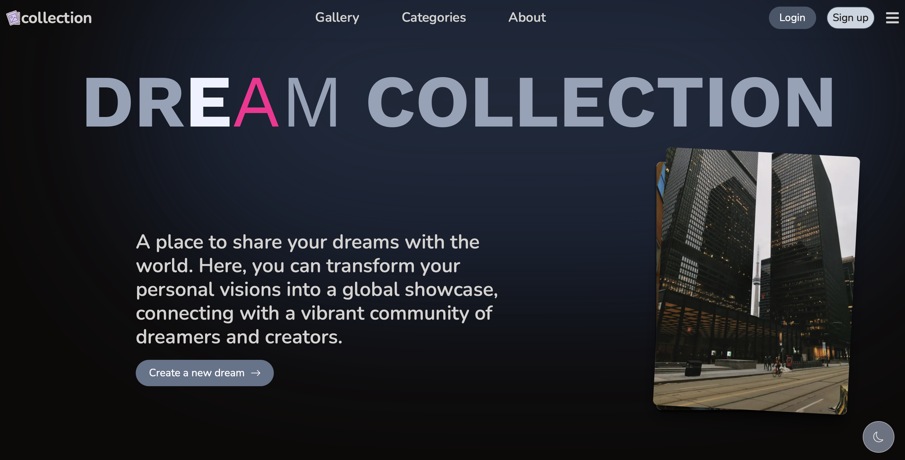
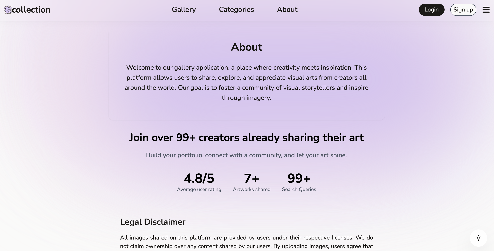
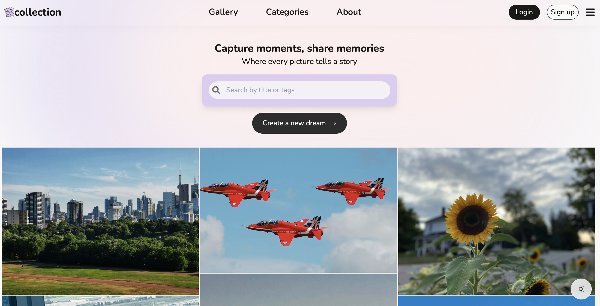
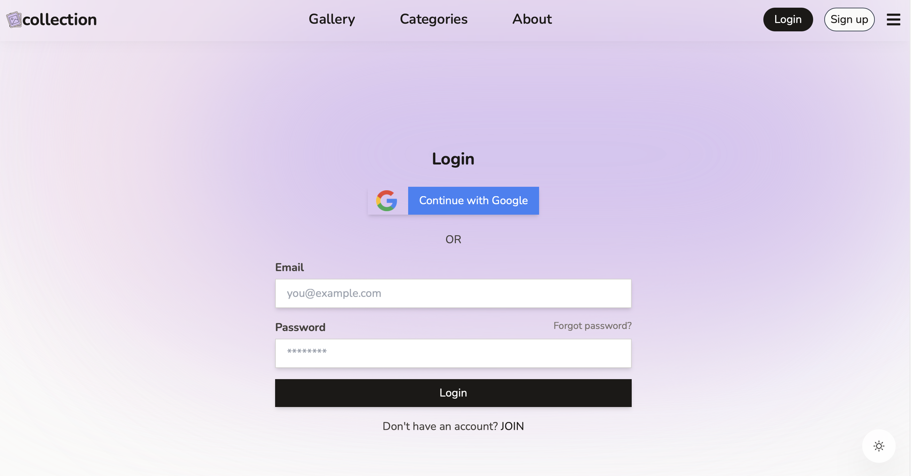

# Dream Collection 🌁🏞️🏙️

Dream Gallery is a Next.js-based web platform where users can create and share their dreams through visual storytelling. The app provides a smooth and engaging user experience, allowing users to browse through shared posts, create their own, and manage profiles. The following sections describe the features, architecture, deployment, and setup instructions.

## Deployment

The application is live and can be accessed at [https://project-6-pied-ten.vercel.app](https://project-6-pied-ten.vercel.app).

## Screenshots

Different sections of application here to provide a visual overview.

### Home Page

### Dark Home Page

### Collections page

### About Page

### Gallery page

### Login page

## Features

- **Responsive Design:**: Built with Tailwind CSS for a fully responsive experience on any device.
- **AWS S3 Integration:**: Efficient image upload and storage using AWS S3.
- **User Authentication**: Secure user authentication using NextAuth.js and Google Auth for managing login and user sessions.
- **Lazy Loading Feed**: Posts are dynamically loaded as the user scrolls, optimizing performance.
- **Post Creation**: Users can upload images and create posts with titles, descriptions, and tags.
- **Profile Management**: Users can edit their profiles, change profile pictures, and manage posts.
- **Dark Mode**: Theme toggle functionality allowing users to switch between light and dark modes.

## Technologies

- **Next.js**: For server-side rendering and API routing.
- **Tailwind CSS**: For a modern, utility-first CSS framework.
- **MongoDB**: NoSQL database for storing users, posts, and related data.
- **NextAuth.js**: Authentication and session management.
- **AWS S3**: For image uploads and storage.

## Technologies

- **Responsive Grid**: Adjusts product display based on screen width, with 1, 3, or 4 columns using dynamic column sizing.
- **Event Handling**: Responds to user actions such as category selection, sorting, item count changes, and view mode updates.
- **Post Management**: Allows users to add, edit, or delete posts, update quantities, and view posts using the PostService.
- **HTTP Requests**: Fetches post data from an API using the PostService.

## Setup Instructions

1. **Clone Repository**: `git clone https://project-6-pied-ten.vercel.app`
2. **Install Dependencies**: `npm install`
3. **Run Development Server**: `ng serve`
4. **Open Browser**: Navigate to `http://localhost:3000/` to view the application.

## License

This project is licensed under the MIT License - see the [LICENSE](LICENSE) file for details.
